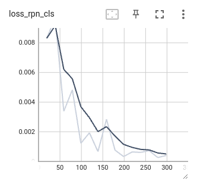
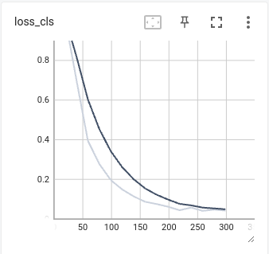
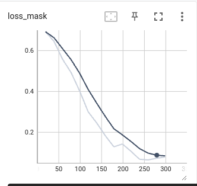
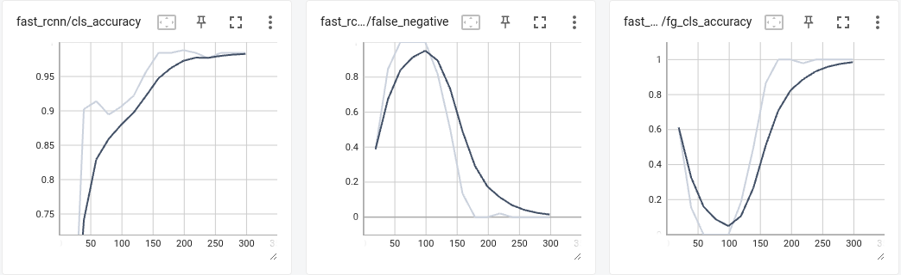
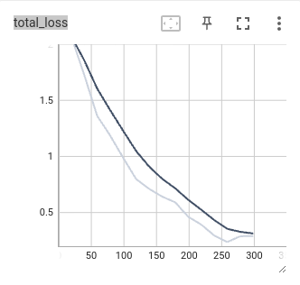
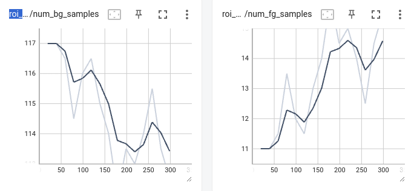

# Detectron2 Food Segmentation Project

This repository contains code for food segmentation using the Detectron2 library and Pytorch and Cuda Dockerfile.

## Setup

- Clone this repository:
   ```bash
   git clone https://github.com/nasrin117/detectron2-food-segmentaion.git
   cd detectron2-food-segmentation
- Build and run the Docker container using the provided Dockerfile with following guidance.
```change directory to root file of project 
    Build the Docker Image:
    docker build -t detectron2-food-segmentation .
    Run the Docker Container:
    docker run -it detectron2-food-segmentation
```


#### Install requirments and dependecies 

 `pip install -r requirements.txt`


## Data Preparation

Download the dataset in COCO format from [here](https://universe.roboflow.com/nafi-ahmet-turgut-l8fgu/food-plates) and follow the data preparation steps.

Your data directory should be like this:

    ├── dataset/
    │ ├── train/
    │ ├── valid/
    │ └── test/
    ├── Detectron2/
    ├── code/
    │ ├── train.py
    │ ├── test.py
    │ └── output/


## Download trained model

You can download the trained `model.pth` . This file contains the weights of the trained model after training using `train.py`.

To make predictions using the trained model, follow these steps:

1. Download the `model.pth` file from [this-link](https://drive.google.com/drive/folders/1sCfTTS-a0PhTn5z-kIzXC2bR1cMslB_a?usp=sharing)
2. Place the downloaded `model.pth` file for `--model-path` command-line argument in test.py.


## Training 

##### You can train model on the data using the command below:

    ```python code/train.py --train-ann-path /path/to/train_annotations.json --train-img-dir /path/to/train_images --val-ann-path /path/to/val_annotations.json --val-img-dir /path/to/val_images --config-path /path/to/config.yaml --num-classes 2 --max-iter 300```

## Make Predictions

After downloading the trained `model.pth` file, you can use the `test.py` script to make predictions on new images. Here's how:

1. Ensure you have the necessary dependencies installed by running:
   
   `pip install -r requirements.txt`

    Download trained model : [here](https://drive.google.com/drive/folders/1sCfTTS-a0PhTn5z-kIzXC2bR1cMslB_a?usp=sharing)

##### You can perform prediction on your image using the command below:

    `python code/test.py --model-path /path/to/model.pth --config /path/to/config.yaml --image-path /path/to/test_image.jpg`

## Dataset detail  

Our dataset comprises a total of 3915 original images. For the purpose of validation, 240 images (approximately 6% of the dataset) were set aside, while another 175 images (approximately 4%) were designated for testing. The remaining 89% of the data, totaling 3.5k images, was utilized for training.

## Results and Visualizations

Here are some visualizations and results from the project. These images showcase various aspects of the training process and model performance.

### Training Metrics

| **Loss RPN Classification** | **Loss Classification** | **Loss Mask** |
| ------ | ------ | ------ |
|  |  |  |


| **Fast R-CNN Loss** |
| ------ |
|  |


| Total Loss | **ROI Head Loss:** |
| ------ | ------ |
|  |  |


### Hardware Specifications

These results were obtained using the following hardware configuration:

- **CPU:** AMD Ryzen 7 4800H with Radeon Graphics
- **Memory:** 16.0 GiB
- **GPU Model:** GeForce GTX 1660 Ti Mobile
- **GPU Memory:** 6 GiB

##  contributer 
Nasrin Azimi : nasrinazimi117@gmail.com